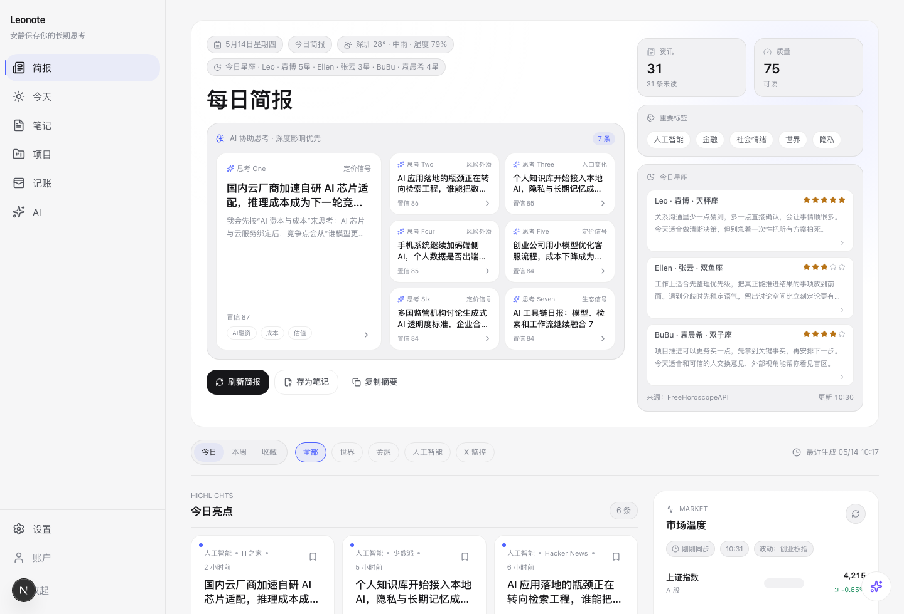
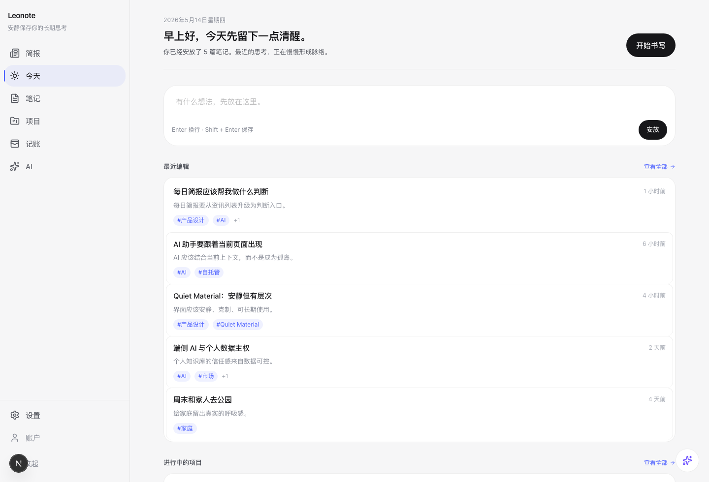
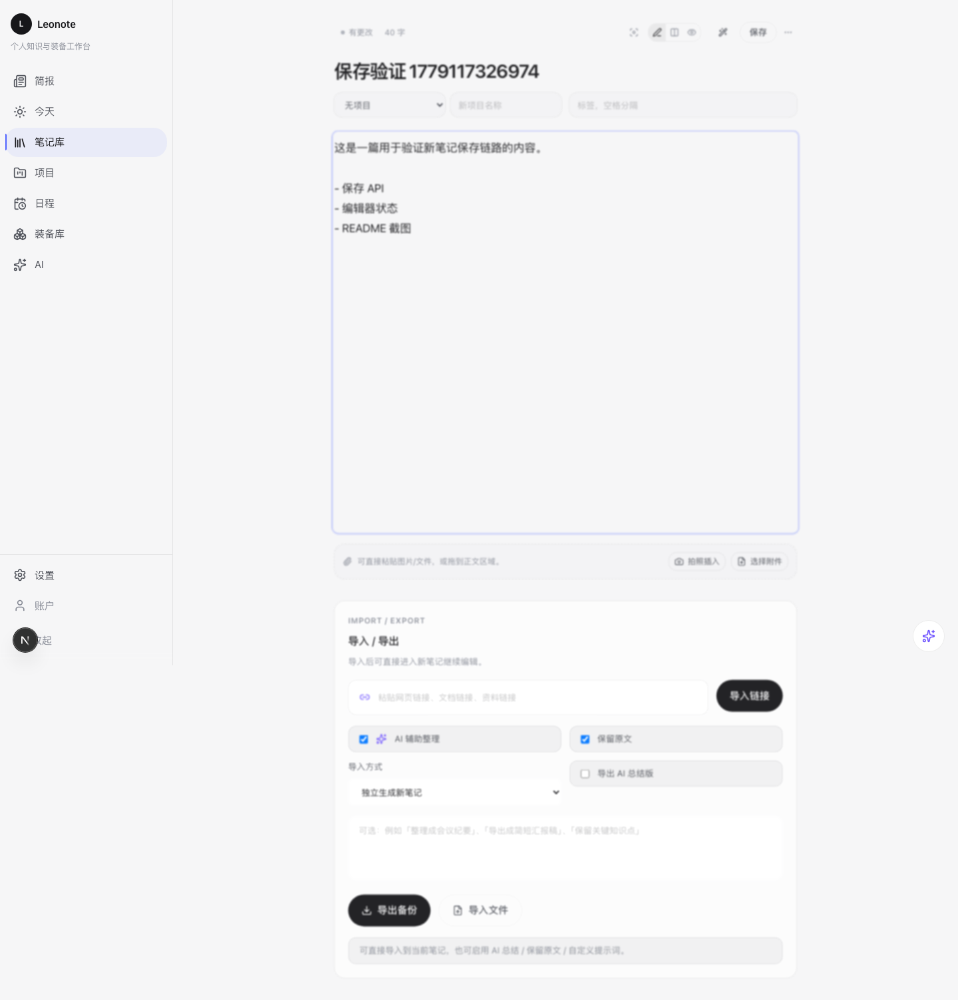
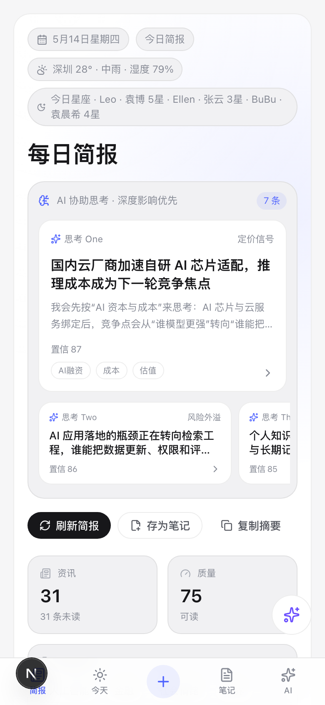

<h1 align="center">
  &nbsp;
  Leonote
</h1>

<p align="center">
  <b>自托管优先的个人笔记、长期记忆、每日简报、Leo 物资装备库与轻记账应用。</b><br>
  把想法安放成时间里的智慧 — A quiet home for notes, memory, and daily intelligence.<br>
  <a href="#产品预览">产品预览</a> ·
  <a href="#核心模块">核心模块</a> ·
  <a href="#快速开始">快速开始</a> ·
  <a href="#跨设备使用">跨端</a> ·
  <a href="#自托管生产部署">部署</a> ·
  <a href="#技术栈">技术栈</a> ·
  <a href="#版本记录">版本记录</a> ·
  <a href="./README.en.md">English</a>
</p>

<p align="center">
  <a href="https://github.com/leoyb1010/leonote/releases">
    
  </a>
  
  
  
  
  
  
  
</p>

<p align="center">
  
</p>

<p align="center">
  <sub>安静保存、温柔唤回。在 Mac / PC / iPad / 手机和桌面 WebView 壳之间保持同一个知识居所。</sub>
</p>

<p align="center">
  简体中文 | <a href="./README.en.md">English</a>
</p>

---

## 产品预览

> 截图随 v1.8.1 Quiet Material 文档维护，覆盖桌面端、笔记编辑、移动端简报与日程工作台。

<table>
  <tr>
    <td align="center"><b>每日简报 · 桌面端</b></td>
    <td align="center"><b>今日页面 · 桌面端</b></td>
  </tr>
  <tr>
    <td></td>
    <td></td>
  </tr>
  <tr>
    <td align="center"><b>笔记编辑 · 桌面端</b></td>
    <td align="center"><b>每日简报 · 移动端</b></td>
  </tr>
  <tr>
    <td></td>
    <td align="center"></td>
  </tr>
</table>

## 核心模块

| 模块 | 能力 |
|---|---|
| 笔记与长期记忆 | Markdown 写作、标签/项目、收藏/置顶/归档、版本历史、正文内联图片/附件、系统摄像头拍照插入正文、AI 长期记忆 |
| 每日简报 | RSS / Tavily / CoinGecko / 新浪行情聚合，AI 中文摘要、质量评分、标签、市场温度、天气与星座 |
| AI 协助思考 | 从国内外当日大事件、AI 科技行业与重要公开信息中筛选深度影响事件，形成大事件雷达 + 7 条可继续推演的思考 |
| 全局 AI 助手 | 从当前页面呼出，自动带入路径、标题、选中文本与页面摘要，适合边读边问、边写边整理 |
| 日程 | 个人时间线、今日/本周视图、日程关联笔记/项目/装备，让内容进入具体时间块 |
| Leo 物资装备库与记账 | 设备/物品型号快速入库，记录价格、渠道、保修、序列号、状态与位置；可同步生成关联支出，并保留快速记账、分类管理、周/月统计、软删除与历史保留 |
| 自托管与跨端 | SQLite 单文件、Docker / PM2 / Node 部署、PWA、Tauri WebView 壳、Mac / PC / iPad / 手机统一访问 |

## 快速开始

### 本地开发

```bash
git clone https://github.com/leoyb1010/leonote.git
cd leonote

cp .env.example .env
# 编辑 .env，至少设置 AUTH_SECRET 和 DATABASE_URL
# 生成随机密钥: openssl rand -base64 48

npm install
npx prisma migrate deploy
npm run dev
```

打开 http://localhost:3000，注册第一个账号即可使用。

### 自托管生产部署

```bash
npm install
npm run build
npm run start:prod   # 自动执行 migration + 启动服务
```

服务运行在 http://0.0.0.0:4317，建议前置 Nginx/Caddy 反代并配置 HTTPS。

### Docker 部署

```bash
cp .env.example .env.production
# 编辑 .env.production
docker compose up -d --build
```

详细部署说明见 [`docs/deployment.md`](docs/deployment.md)。

---

## 跨设备使用

| 设备 | 访问方式 |
|---|---|
| Mac / PC 浏览器 | 直接访问部署域名 |
| 手机浏览器 (iOS / 鸿蒙 / Android) | 直接访问部署域名 |
| iOS PWA | Safari → 添加到主屏幕 |
| 桌面端 App | Tauri WebView 壳，指向部署域名 |

**关键要点：**
- 选一台机器部署 server（个人 Mac/PC 或云服务器），手机和桌面都访问同一域名
- 桌面端是 WebView 壳，不负责本地存储，所有数据在服务端
- 数据库文件路径：`./data/leonote.db`（SQLite 单文件）
- 备份方式：复制数据库文件，或使用设置页的 JSON 导出功能（推荐每月备份）

---

## 环境变量

```env
# 必填
AUTH_SECRET="change-me-to-a-long-random-secret"

# 数据库
DATABASE_URL="file:./data/leonote.db"

# 部署域名（用于桌面端 WebView）
LEONOTE_PUBLIC_URL="https://leonote.example.com"

# 是否允许新用户注册（首个用户始终可注册）
LEONOTE_ALLOW_REGISTRATION="false"

# 仅当前置反代会安全覆盖 X-Forwarded-For / X-Real-IP 时开启
LEONOTE_TRUST_PROXY_HEADERS="false"

# 允许 AI Base URL 使用 http（默认 false，只允许 https）
# 仅限可信内网出口代理或本地隔离测试环境使用
LEONOTE_AI_ALLOW_HTTP="false"

# PWA service worker 缓存版本（可选，建议生产构建时注入 git sha 或发布时间戳）
NEXT_PUBLIC_LEONOTE_BUILD_ID="local"

# AI 配置（可选，使用 DeepSeek 兼容接口）
AI_BASE_URL="https://api.deepseek.com"
AI_MODEL="deepseek-v4-flash"
AI_FALLBACK_MODEL="deepseek-v4-pro"

# 每日简报
BRIEFING_CRON_TOKEN="change-me-long-random-token"
BRIEFING_AUTO_REFRESH="true"
BRIEFING_MIN_ITEMS="24"
BRIEFING_MAX_AGE_MINUTES="5"
BRIEFING_TRANSLATE_ENGLISH="true"
BRIEFING_TRANSLATE_MAX_ITEMS="12"
BRIEFING_TRANSLATE_TIMEOUT_MS="30000"
RSSHUB_BASE_URL="https://rsshub.app"
```

**配置约束：**
- `AUTH_SECRET` 必须使用足够长的随机字符串；改动后已有 session 会失效
- `DATABASE_URL` 默认指向 SQLite 文件，生产和测试必须使用不同数据库
- `LEONOTE_ALLOW_REGISTRATION=false` 时，仅允许首个用户初始化注册
- `AI_BASE_URL` 和设置页保存的 AI Base URL 默认只允许 `https`
- 如需允许 `http` AI 地址，必须显式设置 `LEONOTE_AI_ALLOW_HTTP=true`，且仍会拦截 localhost、内网、link-local、metadata、保留地址和不安全跳转
- `NEXT_PUBLIC_LEONOTE_BUILD_ID` 用于 PWA 缓存命名；生产建议注入 git commit sha，避免 service worker 长期复用旧缓存

---

## 功能总览

### 数字居所 (v1.4)
- 首页 Hero 区：时间问候语 + "安放了X篇" 统计 + 开始书写
- QuickCapture Dock：仪式感安放入口
- 记忆闪回：21天前笔记轻提醒
- 本周沉淀：新增/编辑/回看/长期记忆统计
- 2xl 大屏右栏布局（主内容+320px侧栏）

### 日程与时间线 (v1.8)
- 新增个人日程模块：今日 / 本周视图、时间块创建、完成/恢复/删除、颜色标记
- 日程可关联笔记、项目和装备，首页显示今日安排，项目卡片显示近期关联日程
- 大屏工作台宽度升级到 1680px 档位，首页、笔记库、项目、装备与日程减少两侧空白，按页面类型提升信息密度
- Cal-like 工作台视觉：统一 PageHeader、对象库列表、指标卡、快捷入口、图标语义和移动端底部导航

### Leo 物资装备库与记账 (v1.7)
- `/ledger` 默认进入「Leo 物资装备库」模式，原轻记账完整保留在同页「记账」标签下
- 快速入库：输入设备/物品型号、价格、渠道、保修、序列号等自然文本，自动拆出品牌、分类、金额、购买渠道与保修日期
- 链接识别：粘贴商品页链接可自动读取 JSON-LD / OpenGraph 中的设备型号、品牌、价格、币种、商品摘要与部分规格，作为可编辑草稿入库
- 装备详情：支持状态、位置、序列号、购买日期、保修到期、规格 JSON、备注与软删除
- 支出关联：带价格的装备可同步生成一条关联支出，后续仍可在记账区查看、统计和管理
- 5秒记账：输入"拿铁 35"自动识别金额 + 类型；自定义类型、月度/本周合计、类型分布、最近记录与历史保留继续可用

### 每日简报 (v1.7.0)
- 移动端信息架构重排：新增粘性快捷导航，按「雷达 / 精选 / 思考 / 资讯」拆开阅读路径，小屏优先减少卡片堆叠和横向溢出
- 资讯区升级为「精选证据」+「全部资讯」双层结构，首屏先看高质量来源，继续下滑再进入密集信息流
- 大事件雷达与 Hero 在 320px / 390px 等窄屏下使用更稳定的网格与按钮布局，避免内容顶出视口
- 星座实时源日期规则明确：Asia/Shanghai 同日源直接有效；上海时间 00:00-07:59 允许西方源仍停留在昨天；08:00 后拒绝昨天源
- Hero 头部压缩：修复“每日简报”标题下方大面积空白，取消右侧高卡片撑开布局；日期、天气、星座、标题、操作、指标、标签与市场温度统一为紧凑日报头
- 市场温度胶囊：金融行情从 Sidebar 大卡改为日期天气下方的横向胶囊，保留中国市场颜色习惯：红色上涨、绿色下跌，并可直接刷新
- 大事件雷达分桶：新增国际大事、国内大事、市场定价、AI 科技、科技产业分桶与多源去重，不再让 AI 科技源独占“大事件”；同一来源过量时自动限流，让国内外实时大事件能进入首屏
- 值得继续想可点击：从主内容大块静态卡片改为右侧紧凑思考面板，每条思考都是可点击入口，桌面按点击位置弹出详情，移动端使用底部安全抽屉
- 大事件雷达：简报首屏从“资讯卡片堆叠”升级为“今日大事件雷达”，优先呈现国际/国内/AI 科技/市场中真正有深远影响的事件；1 条主事件 + 6 条紧凑事件入口，点击后在鼠标位置或移动端底部安全面板查看详情
- 高频资讯刷新：白天 RSS 抓取提升到 5 分钟粒度，清晨 10 分钟粒度；首屏自动补抓默认新鲜度阈值收紧到 5 分钟；市场行情交易时段 5 分钟同步，Tavily 作为 4 个时间点的补充兜底
- 首页 IA 重排：Hero 保留日期、天气、星座、质量指标和操作按钮；大事件雷达成为主阅读入口，精选资讯改为“证据库”，减少无效空白和重复阅读成本
- 复制摘要升级：复制/存笔记内容纳入大事件雷达、AI 协助思考和精选资讯，输出更接近“个人日报”而不是普通新闻列表
- 笔记拍照插入：编辑器新增系统摄像头拍照面板，桌面端通过 `getUserMedia` 调用摄像头，移动端支持 `capture=environment` 兜底；拍摄后自动上传为附件并插入当前正文光标位置
- 多源抓取：RSS / Tavily / CoinGecko / 新浪行情，支持 Cron 定时抓取、行情刷新与日报生成
- AI 协助思考：每日简报 Hero 从表层标题升级为不少于 7 条“深度影响/分析价值”思考，优先筛选国内外实时发生的 AI 科技大事件，并结合来源质量、长期记忆、近期笔记与标签判断模型平台、算力芯片、产品入口、资本成本、安全治理、开发者生态和社会情绪的潜在传导
- AI 思考区版面优化：保留 7 条思考信息，从“六张等权卡片”调整为“1 条主思考 + 6 条紧凑入口”，降低首屏空白和卡片重复感，让 Hero 更像今日判断入口而不是信息堆叠
- AI 思考区体验修正：默认展示紧凑思考卡片，命名为“思考一 / 思考二 / 思考三 …”，点击后再拉起轻量详情气泡，避免 Hero 区占据过多首屏空间；详情气泡保留影响判断、追问问题、来源依据和标签
- AI 思考移动端抽屉修复：iPhone 与小屏 iPad 使用可靠的底部抽屉结构，支持 `100vh` / `100dvh` 双兜底、safe-area 关闭按钮、顶部 drag handle 与内部独立滚动，避免详情内容被顶出屏幕或只能看到底部一条
- AI 思考信号加强：从单一示例触发改为 AI 科技优先的影响评分体系；前沿模型/平台、AI 算力与芯片、AI 产品入口、AI 资本与成本、AI 安全治理、AI 开发生态独立竞争，外交/政策事件只作为窄触发的补充特例，不再盖过普通但重要的 AI 科技大事件
- 简报响应式布局升级：Hero 右侧指标与星座面板提前到 `md` 断点显示，主内容与 Sidebar 提前到 `lg` 双列；今日亮点、全部资讯、AI 思考和星座区在 sm / md / lg / xl / 2xl 下使用更紧凑的网格与间距，减少中段大块留白
- 资讯源扩容与可靠性治理：新增 IT之家、少数派、V2EX、LinuxDo、微博热搜、知乎热榜、B站排行榜、掘金热榜、GitHub Trending、The Verge、Ars Technica、WIRED、MIT Technology Review、TechCrunch、Engadget、IEEE Spectrum、OpenAI Blog、DeepMind、Google Research、Hugging Face、arXiv、Simon Willison、Ben's Bites、TLDR AI、Import AI、MarkTechPost、Hacker News、ByteByteGo、The Pragmatic Engineer、GitHub Blog、Cloudflare、Product Hunt、Stratechery、Benedict Evans、a16z、VentureBeat、BleepingComputer、KrebsOnSecurity、The Register、404 Media 等真实 RSS 源；RSSHub 域名可通过 `RSSHUB_BASE_URL` 替换
- 首页自动补抓：简报页与刷新 API 会在内容不足、抓取过期或当日 digest 缺失时自动执行 RSS 抓取 + digest 标准化，避免 Cron 未跑或源刚恢复时出现“全部资讯空白”
- 高频刷新：白天 RSS 抓取升级到 10 分钟粒度，默认首屏新鲜度阈值收紧到 10 分钟，最低内容量提升到 24 条
- 抓取后即标准化：RSS 入库时保存更完整的正文摘录；digest 生成时统一做简体中文翻译/改写、摘要兜底、要点抽取、评分与标签生成
- 英文源中文化：配置 AI Key 后，英文标题/摘要/正文摘录会自动翻译成自然简体中文；没有 AI Key 时仍优先展示中文源内容，不让首页空白
- AI 摘要 + 质量评分 + 自动标签，统一输出为适合中文阅读的简报结构
- 全新日报式信息架构：可编辑标题、日期范围、刷新简报、存为笔记、复制摘要
- Hero 概览区：资讯数量、未读数量、平均质量分、重要标签、深圳天气 widget
- 核心阅读区：今日亮点、全部资讯流、深度阅读卡片、标签与洞察分布
- 市场温度侧栏：sparkline 走势、涨跌幅、波动最大标的、行情同步状态
- 底部/侧栏状态：生成时间、新闻同步时间、数据来源数量、最近 Cron 状态
- 详情弹窗只展示用户真正需要的信息：标题、来源、发布时间、评分、标签、AI 摘要、要点、编辑摘录、原文入口
- 详情弹窗可直接阅读主要内容：智能摘要永不空白，正文摘录长度提升并过滤 RSS/URL/广告/关注公众号等噪音，不再强迫每条都跳原文；移动端长内容弹窗增加固定关闭入口、底部关闭按钮与 safe-area 适配
- 数据标准化 pipeline：日期、评分、摘要长度、标签、要点、详情摘录、digest JSON、market points 全部统一清洗与容错
- 严格过滤内部/技术/低价值字段：前端 DTO 不再暴露原始 `content`，避免 RSS/Tavily 原文、JSON、URL、GUID、来源调试信息进入详情
- 一键导入 news → note / 今日简报 → note，导入内容使用同一套清洗后的展示字段
- 全局 AI 助手：保留独立 AI 页，同时新增全局右侧/移动端底部呼出入口，自动带入当前页面路径、标题、选中文本和页面摘要，让 AI 问答与正在阅读/写作的上下文绑定
- 全局 AI 助手交互修正：统一通过 body portal 与专用浮层卡片从视口右侧呼出，避免普通卡片样式把 `fixed` 定位覆盖成 `relative` 导致左侧错位；桌面不铺满遮罩，移动端使用右侧 `100dvh` 面板，顶部关闭按钮固定可见，降低遮挡和无法关闭风险
- 今日星座运势：天气信息后展示袁博=我/天秤座、张云=老婆/双鱼座、袁晨希=女儿/双子座；实时源优先使用 FreeHoroscopeAPI 今日 JSON，其次 Horoscope.com / Astrology.com 今日页，AstroSage RSS 仅在新鲜度校验通过时作为备选；Asia/Shanghai 00:00-07:59 允许西方源仍停留在昨天，08:00 后拒绝昨天源；不再使用本地运势兜底文案；英文源会优先用已配置 AI 翻译为简体中文，无 AI Key 时使用源文本驱动的中文摘要
- 笔记正文内联附件：图片、文档通过粘贴/拖拽/选择上传后会插入当前光标位置，图片直接作为 Markdown 图片显示在正文里，附件列表继续保留管理能力

### 写作体验 (v1.4)
- Focus Mode 安静写作：编辑器降噪、内容居中
- Apple 风格编辑器 — 760px 固定宽度，17px 字体，1.78 行高（大屏 18px）
- 保存仪式感："已安静保存" / "正在安放…"，1.6s 淡出
- layout 动画预览/分栏切换

### 笔记核心
- Markdown 编辑 + 实时安全预览（支持 GFM 表格、任务列表、代码块）
- 自动保存（默认关闭，可在编辑器更多菜单手动开启）
- 手动保存 / Cmd+S 快捷键
- 版本历史（NoteRevision）— 保存时自动快照、查看、恢复历史版本
- 标签系统、项目归属、收藏、置顶、归档、回收站
- 快速记录（QuickCapture）— 今日页面直接输入，回车保存

### 静读助手 (v1.4 AI)
- 提炼要点、整理长期记忆
- ThinkingLine 思考态动画
- 全局 AI 对话
- 导入时 AI 自动整理
- DeepSeek / OpenAI 兼容接口
- AI Key 数据库加密存储（AES-256-GCM）
- AI Base URL 保存与调用前都会做 SSRF 防护，并逐跳校验重定向目标

### 搜索
- FTS5 全文搜索 + trigram 分词器，中文短语匹配
- 搜索结果关联笔记列表，实时过滤

### 导入导出
- 导入：JSON / Markdown / TXT / HTML / 网页链接
- 导出：JSON 全量导出 / 当前笔记 Markdown 导出
- 导入链接 SSRF 防御：手动逐跳处理重定向，限制跳转次数，拦截 localhost、内网、link-local、metadata 和保留地址

### 安全
- Session 签名 cookie（tokenVersion 机制，改密立即失效全部旧会话）
- 登录 / 注册 / AI 接口三级限流（含 LRU Map GC）
- 生产环境 `__Host-` cookie 前缀
- Markdown 预览 XSS 防御（rehype-sanitize）
- 注册开关控制（首个用户后默认关闭）
- AUTH_SECRET 强制验证
- 首个用户注册使用进程内初始化锁 + Prisma transaction，降低并发初始化竞态
- 所有 JSON API 使用统一 JSON body 解析，非法 JSON 返回 400
- 笔记更新与标签同步放在同一事务中，避免部分写入
- 自动保存使用版本/dirty 队列，保存中继续编辑不会被误标为已保存

### PWA
- `public/sw.js` 提供 manifest、图标和离线页缓存
- Service worker 通过注册 URL 的 `v` 参数生成 cache name
- 生产构建建议设置 `NEXT_PUBLIC_LEONOTE_BUILD_ID=$(git rev-parse --short HEAD)`
- HTML 页面采用 network-first，静态资源采用 cache-first + 后台刷新
- API 请求不会进入 service worker 缓存

### 设计 (v1.4 Quiet Material)
- Quiet Material 设计语言：material-canvas/elevated/inset + hairline border
- 深色 / 浅色自适应主题（Design Token 体系，支持 Light/Dark/System 三态）
- 大屏响应式布局：侧边栏 264px (2xl: 288px)、导航项 44px hit-target
- 全局环境背景（极淡径向渐变）
- 响应式布局（桌面侧栏 / 移动端底部 TabBar）
- 全局命令面板（Cmd+K）
- 移动端 safe-area 适配
- 中文字体栈优化（PingFang SC / Microsoft YaHei / Noto Sans SC）
- PageContainer 6 种宽度变体（dashboard/reader/workbench/ai 2xl 放大）

---

## 技术栈

| 层级 | 技术 |
|---|---|
| 框架 | Next.js 16 + React 19 + TypeScript |
| 数据库 | Prisma + SQLite |
| 样式 | Tailwind CSS + CSS Variables Design Token |
| 桌面端 | Tauri 2（纯 WebView 壳，不启动本地 Node） |
| AI | DeepSeek / OpenAI 兼容接口 |
| 测试 | Vitest（单测）+ Playwright（E2E） |
| 部署 | Docker / PM2 / 直接运行 |

---

## 数据模型

```
User (用户)
  ├── Note (笔记) → Tag (标签) via NoteTag
  │     ├── NoteRevision (版本历史)
  │     └── NoteAttachment (附件：文件/图片)
  ├── Project (项目)
  ├── DailyNote (每日记录)
  ├── NewsSource / NewsItem / UserBriefingState (每日简报资讯与用户状态)
  ├── MarketSnapshot / BriefingDigest / CronRun (行情、日报摘要、定时任务记录)
  ├── AISetting (AI 配置，API Key 加密存储)
  └── MemoryFact (AI 长期记忆)
```

---

## 工程命令

```bash
npm run dev          # 本地开发
npm run build        # 生产构建
npm run start:prod   # 生产启动（含 migration）
npm run lint         # ESLint
npm run typecheck    # TypeScript 类型检查
npm run test         # 单元测试（vitest）
npm run test:e2e     # E2E 测试（playwright）
npm run ci           # 全链路：lint → typecheck → test → build
```

### 测试隔离

- 单元测试使用 Vitest，不会启动 Next 服务
- E2E 使用 Playwright，会自动启动 `npm run dev -- -p 4318`，并在结束后关闭
- Playwright 默认数据库为 `file:/private/tmp/leonote-e2e.db`
- 如需自定义 E2E 数据库，请设置 `E2E_DATABASE_URL`
- 不要把生产 `DATABASE_URL` 传给 Playwright；配置中会检测并阻止误用
- E2E 默认设置 `LEONOTE_ALLOW_REGISTRATION=true`，避免污染真实首个用户初始化逻辑

```bash
E2E_DATABASE_URL="file:/private/tmp/leonote-e2e.db" npm run test:e2e
```

---

## 项目文档

- [`docs/deployment.md`](docs/deployment.md) — 生产部署指南（Nginx / Docker / PM2 / 备份策略）
- [`docs/desktop.md`](docs/desktop.md) — 桌面端构建说明
- [`PRD.md`](PRD.md) — 产品需求文档

---

## 备份数据

1. **文件级**：复制 `prisma/data/leonote.db`
2. **JSON 导出**：设置页 → 数据备份 → 导出全部笔记
3. Docker 用户：`./data` 已挂载为 volume

推荐每月执行一次 JSON 导出 + 数据库文件备份。

---

## AI 配置说明

Leonote 使用 OpenAI 兼容的 `/chat/completions` 接口。默认配置指向 DeepSeek：

```env
AI_BASE_URL="https://api.deepseek.com"
AI_MODEL="deepseek-v4-flash"
AI_FALLBACK_MODEL="deepseek-v4-pro"
```

也可以在设置页为当前账号保存 Base URL、API Key 和模型。API Key 会加密存储，接口返回时只返回脱敏值，不返回密文。

Base URL 安全规则：
- 默认只允许 `https`
- `LEONOTE_AI_ALLOW_HTTP=true` 后才允许 `http`
- 保存和实际调用前都会校验协议、主机名和 DNS 解析结果
- 调用时手动处理重定向，每一跳都会重新校验
- 禁止 localhost、内网、link-local、metadata、组播、保留地址和带用户名密码的 URL

---

## 版本记录

| 版本 | 日期 | 更新内容 |
|---|---|---|
| **v1.8.2** | 2026-05-24 | 每日简报详情与移动端体验大升级，并整站铺开移动端紧凑化；品牌侧把"装备库"正式升级为「Leo 物资装备库」。简报详情：核心摘要改为醒目卡片置顶展示，关键要点在 `aiKeyPoints` 为空时自动从 `detailText` 拆出 2-3 句兜底，正文摘录默认折叠为"展开原文摘录"按钮，且强化 RSS 噪音过滤（评论标记 `回复/楼主/沙发/引用/Reply/Re:/@用户名`、楼层元数据 `12 个回复`/`#3 楼`、纯时间戳 / 日期前缀、`+1/同意/哈哈哈/mark` 等短回复、连续 emoji 行整行丢弃，并按行前 48 字符去重），社区源详情不再被评论占满。简报自动跨日：客户端按 `Asia/Shanghai` 自然日检测换天，每 60s + `visibilitychange→visible` 时校验，跨日时强制 `refresh=1` 调用，服务端 `getDailyHoroscopes(force)` 同步重拉，星座 / 大事件 / 资讯统一跟随北京日历滚动到新一天，不再需要手动 F5。简报移动端 Hero 紧凑化：标题改 `text-2xl` 单行；"刷新简报 / 存为笔记 / 复制摘要"三按钮在移动端折成"刷新 + ⋯ 菜单"，桌面端 Bento 保持原样；`Information` / `Avg Score` / `Top Tags` 三个 Bento stats 卡在 `md` 以下整体 hidden（侧栏 / 底部 TagInsights 已有同款）；`MobileBriefingNav` 锚点条移除；`Market Pulse` 默认折叠为一行 4 个紧凑 chip（前 3-4 个市场 + 涨跌幅），点击 chevron 展开完整横滚卡片；`HoroscopeStrip` 从原 2×2 网格改为移动端纵向 list（每行一个家人：左侧名字 + 摘要 line-clamp-1，右侧星等），三张卡 1 屏内全部可见。移动端首屏在第一条新闻之前从 ~1000px 压缩到 ~350px。整站铺开移动端紧凑化（桌面端 0 改动）：`/schedule` MetricCard 在 mobile 改为 `grid-cols-2` 紧凑布局，padding 缩小，hint 隐藏；`/ledger` 顶部 hero icon + `Object Library` eyebrow + 描述行在 mobile 隐藏，标题 `text-lg`，Ledger 子 hero 描述行隐藏，`LedgerDashboard` 改 `grid-cols-2` 紧凑卡且 `TrendLine` SVG 卡在 mobile 隐藏，`CategoryDistribution` 默认只显前 4 类、"还有 N 类"按钮展开；`/settings` `AccountCenter` 4 个 status 子卡 + 创建/更新/模式三行细节在 mobile 隐藏，头像 `h-10`，`AISettingsPanel` 与 `MemoryFactsPanel` 描述行 / `AISpark` 背景动画 mobile 隐藏，整体 padding 缩小；`/favorites` `MemoryFactsPanel` 整段在 mobile 隐藏（在 `/settings` 仍可查看），收藏列表直接进首屏；`/projects` 新建项目区域 `Object Library` eyebrow + "看板视图" chip mobile 隐藏，`textarea` 在 mobile 隐藏（先用名字快速创建、回头编辑补描述），项目卡 padding `p-3.5`、描述 `line-clamp-2`，"最近活跃" + "近期日程" 在 mobile 隐藏。品牌：`/ledger` 主标题、`GearLibrary` Hero 标题统一升级为「Leo 物资装备库」，README slogan / 核心模块表 / 功能总览章节标题同步；侧栏与移动端底部 Tab 因空间限制保留"装备库"短称 |
| **v1.1.1** | 2026-05-22 | 安全加固：修复导入链接和 AI Base URL SSRF 重定向绕过；JSON API 非法 body 返回 400；笔记标签事务一致性；首个用户注册并发保护；自动保存 dirty 队列；PWA cache version 注入；E2E 数据库隔离说明 |
| **v1.8.1** | 2026-05-18 | 按 review 文档完成第一轮 + 第二轮升级收尾：修复新建笔记保存失败的根因，当前数据库缺失 `NoteFts` 虚拟表时会导致 Prisma 创建笔记触发器报错，现在新增修复迁移与运行时自愈，创建/更新/删除笔记前会确保 FTS 表、触发器和回填数据存在；移动端底部导航改为「今天 / 简报 / 新建 / 笔记 / 装备库」，补齐装备库入口、safe-area 底部间距和 PWA manifest 快捷入口；首页、简报、笔记库、归档、收藏、搜索、日记和废纸篓统一使用更宽的工作台容器，减少 1440px-1920px 网页端两侧空白；简报继续压缩 Hero 与市场温度区，精选证据和全部资讯恢复大屏多列密度，行情刷新在页面隐藏时暂停，资讯收藏/已读失败会回滚；首页开始书写菜单改为受控弹层，快速记录支持 Enter 保存、Shift+Enter 换行并避开中文输入法误触；记账/装备库标签状态写入 URL，刷新或直接访问 `/ledger?tab=ledger` 不再丢状态；按钮 `asChild` 支持 loading/icon，命令面板补齐核心页面入口；PWA service worker 增加静态资源 cache-first 与更新提示，减少 App Router chunk stale 导致的首次点击失败；清理旧版重复 `app-shell` / `bottom-nav` 残留文件；刷新 README 最新桌面端、笔记编辑和移动端简报截图，并完成 typecheck、lint、test、build、CI 与多分辨率 Playwright 验证 |
| **v1.8.0** | 2026-05-18 | 新增个人日程模块 `/schedule` 与 `/api/schedule`：支持今日/本周时间线、创建时间块、完成/恢复/软删除、颜色标记，并可关联笔记、项目和装备；首页接入今日日程，项目卡片显示近期关联日程；设计系统按 Cal-like 工作台方向继续统一，PageContainer 大屏宽度提升到 1680px，导航、PageHeader、首页、笔记库、项目、装备/记账入口统一为更清晰的对象库与工作台语言；补充日程 helper 回归测试 |
| **v1.7.0** | 2026-05-18 | `/ledger` 升级为「装备库 + 记账」双模式：新增 GearItem 数据模型、迁移、装备 API、自然语言快速入库、商品链接识别预填、装备详情编辑、状态/位置/保修/序列号记录，并支持带价格装备同步生成关联支出；修复 PWA service worker 缓存 Next RSC / App Router 导航导致 `/ledger` 点击后出现 “This page couldn’t load” 的问题，新增路由级错误恢复页；每日简报移动端重排为雷达、精选、思考、资讯四段阅读路径，压缩 Hero、雷达和资讯卡片在 320px / 390px 小屏下的横向溢出；星座源日期规则正式明确为 Asia/Shanghai 同日有效，上海时间 00:00-07:59 可接受西方源昨天日期，08:00 后拒绝昨天源，并补充回归测试 |
| **v1.6.19** | 2026-05-17 | 修复每日星座“看起来一直没刷新”的根因：`刷新简报` 现在会强制刷新星座链路；实时源日期必须等于 Asia/Shanghai 当日，拒绝昨天/前天内容继续占缓存；无 AI Key 时不再只套泛化主题句，而是根据实时英文源文本中的沟通、计划、优先级、意外消息、学习表达等信号生成简体中文摘要；星座卡片与详情增加“运势日”显示，方便确认源内容日期；新增星座摘要回归测试 |
| **v1.6.18** | 2026-05-17 | 全面安全与可靠性修复：图片代理改为 DNS 校验后钉住解析 IP 发起请求，重定向重新校验，降低 DNS rebinding SSRF 风险；附件上传/下载统一清洗 MIME，HTML/SVG/脚本/XML 等主动内容强制 `application/octet-stream` 并下载，响应增加 `nosniff` 与 `CSP sandbox`；全局 AI 与笔记 AI 增加问题长度、页面上下文、笔记正文和长期记忆预算，明确把笔记内容作为资料而非指令；RSS 抓取增加 3MB 响应体上限，避免异常源占满内存；星座实时源失败不再把空结果缓存一整天，部分成功只短缓存 10 分钟；登录/注册限流默认不信任可伪造代理头，新增 `LEONOTE_TRUST_PROXY_HEADERS` 供可信反代部署开启；补充附件与代理限流单元测试 |
| **v1.6.17** | 2026-05-15 | 修复社区论坛噪音进入每日简报：`LinuxDo 最新`、V2EX、微博/知乎/B站/掘金等社区源中带有“求助、请教、大佬、延迟、报错、帖子/参与者”等明显讨论帖特征且缺少发布、政策、融资、漏洞、财报等高影响信号的内容，会在抓取、查询、Digest 和大事件雷达四层过滤；旧数据中已有的类似“Claude 延迟求助”也不会继续进入首页和大事件雷达。同步清理 X 监控模块残留文档、环境变量和测试 |
| **v1.6.16** | 2026-05-15 | 每日简报小幅修正：市场温度固定按“上证、深证、美股、港股、美元/人民币、黄金、虚拟币、石油”排序展示，并补入原油行情源；大事件雷达改为稳定配额，优先保留 1-2 条国际大事、1-2 条国内大事、3-5 条 AI/科技圈事件，避免任一类别刷屏；X 监控改为镜像源优先，默认使用已验证可抓取 OpenAI / Anthropic / DeepMind / Sam Altman / NVIDIA / Karpathy / GitHub RSS 的 `nitter.net`，并自动跳过 XCancel 白名单占位页与 RSSHub 503 页面；简报组件可见英文标签改为简体中文，“思考一/二”命名统一，大事件雷达显示完整 8 个入口；新增回归测试覆盖雷达配额 |
| **v1.6.15** | 2026-05-15 | 修复每日简报 Hero 大面积空白：取消右侧高卡撑开结构，改成紧凑日报头；市场温度从 Sidebar 大卡移动到日期天气下方胶囊，保留红涨绿跌与刷新按钮；大事件雷达改为国际/国内/市场/AI 科技/科技产业/X 信号分桶与来源限流，避免全部被 AI 科技资讯占满；“今天值得继续想”改为右侧可点击思考面板并恢复详情气泡；X 信号新增 XCancel / RSSHub 镜像兜底，未配置官方 X Token 时也会尝试 `rss.xcancel.com`、`xcancel.com` 与多个 RSSHub 镜像 |
| **v1.6.14** | 2026-05-15 | 每日简报升级为大事件雷达 + 证据库结构：Hero 保留日期/天气/星座/指标与操作按钮，主阅读区突出 1 条主大事件 + 6 条紧凑事件入口，点击后按鼠标位置或移动端底部安全面板查看详情；新增关键人物 X 官方 API 信号抓取与 Sidebar 展示，支持 `X_BEARER_TOKEN` / `BRIEFING_X_USERS`，未配置时明确显示待配置；RSS/X 白天刷新提升到 5 分钟粒度，市场行情交易时段 5 分钟同步，Tavily 补充到每日 4 次；复制摘要纳入大事件雷达、AI 思考、X 信号和精选资讯；笔记编辑器新增系统摄像头拍照插入正文能力，移动端使用相机 capture 兜底；README / `.env.example` / 版本号同步更新 |
| **v1.6.13** | 2026-05-14 | 美化 GitHub 仓库 README 首屏：新增居中产品标题、双语 slogan、语言切换入口、版本号、许可、Next.js / Tauri / PWA / Quiet Material 徽章；新增英文 README；补充最新桌面端/移动端产品截图与核心模块总览，方便多语言浏览和对外介绍 |
| **v1.6.12** | 2026-05-12 | 治好 AI 协助思考区的数量强迫症：默认思考生成数从 6 条提升到 7 条，Hero 展示改为“1 条主思考 + 6 条紧凑入口”；移动端继续保留横向滑动紧凑入口。同步更新回归测试，确保足量 AI 科技事件会返回 7 条思考 |
| **v1.6.11** | 2026-05-12 | 优化每日简报 Hero 的 AI 协助思考版面：不增加无意义数量，保留 6 条高价值思考，但改为“1 条主思考 + 5 条紧凑入口”的信息架构；主卡展示标题、影响摘要、置信度和标签，右侧紧凑入口降低重复卡片高度，移动端保持横向滑动入口；同时收紧 Hero 内边距与模块间距，减少首屏大面积空白，尽量不影响其他简报组件 |
| **v1.6.10** | 2026-05-12 | 修复每日星座运势实时性与显示命名：Leo/Ellen/BuBu 改为袁博/张云/袁晨希；星座链路改为 FreeHoroscopeAPI 今日 JSON 优先，Horoscope.com 与 Astrology.com 今日页为备选，并对 AstroSage RSS 做新鲜度校验，拒绝 2020 等过期 RSS，不再展示“本地兜底”运势。星座文案优先用已配置 AI 翻译为简体中文，无 AI Key 时按实时源文本提炼中文摘要，避免星级变化但内容不变。市场温度与 sparkline 改为中国市场习惯：红色代表上涨，绿色代表下跌 |
| **v1.6.9** | 2026-05-12 | 按 `/briefing` v2 指导文档升级简报页响应式密度：Hero 从 `md` 起呈主栏 + 指标/星座栏，主内容与 Sidebar 从 `lg` 起双列，今日亮点与资讯流在 sm/lg/xl 断点自动切换网格，空态高度和卡片间距收紧，减少 768-1279px 与中段阅读区的大块留白。AI 协助思考详情在 iPhone / 小屏 iPad 改为可靠底部抽屉，使用 `100vh` + `100dvh` 双高度兜底、safe-area 关闭按钮、drag handle、flex 内部滚动，避免详情标题、正文、来源和追问被顶出屏幕。星座运势缓存从 6 小时 TTL 改为 Asia/Shanghai 当日 key，新增 `refresh-horoscope` Cron API 与 00:01 / 06:30 两次定时刷新；星座区展示来源与更新时间。README 与 `.env.example` 同步说明 |
| **v1.6.8** | 2026-05-11 | 重做每日简报 AI 协助思考的筛选逻辑：从“用户举例触发器”调整为 AI 科技优先的高影响事件评分体系，前沿模型/平台、AI 算力与芯片、AI 产品入口、AI 资本与成本、AI 安全治理、AI 开发生态独立参与排序；外交/政策类事件仅作为窄触发特例，权重降低，不再因为中美示例盖过其它重要 AI 科技新闻。默认输出不少于 6 条思考，卡片命名改为“思考一 / 二 / 三 …”，标题不再重复套主题前缀；详情文案全部改为“思考”。新增回归测试：普通 AI/产品新闻不会被折叠进地缘判断，足量 AI 科技事件会返回 6 条思考，特朗普访华/黄仁勋/AI 芯片这类复合事件仍可作为政策边界特例识别 |
| **v1.6.7** | 2026-05-11 | 修复浮层定位根因：普通 `card-premium` 全局样式会把 `fixed` 定位覆盖成 `relative`，导致全局 AI 助手从左侧错位呼出、AI 协助思考气泡不按点击位置弹出；新增专用 `floating-card-premium`，全局 AI 助手、AI 思考详情、资讯详情弹窗统一使用真实固定定位。AI 助手桌面端保持右侧内容伴随面板，移动端使用完整安全面板；AI 思考详情改为按鼠标点击坐标居中锚定，空间不足时自动上翻/边界夹紧。收窄地缘科技战略信号触发条件，必须同时满足高层/外交语境、双边语境和政策议题，避免普通 AI、手机、汽车、家电资讯被误判成地缘议题；新增回归测试覆盖普通资讯不误贴地缘判断和特朗普访华/黄仁勋/AI 芯片案例仍能命中战略信号 |
| **v1.6.6** | 2026-05-11 | 每日星座运势接入 AstroSage 三个独立 RSS 源：Leo=我/天秤座、Ellen=老婆/双鱼座、BuBu=女儿/双子座，天气后展示每日五颗星星级和简短运势，RSS 失败时稳定兜底；AI 协助思考详情改为按点击位置锚定弹出，桌面靠近鼠标/卡片位置，移动端继续使用底部安全面板；全局 AI 助手改用 body portal 渲染并强制右侧锚定，规避父级布局导致左侧错位/遮挡；AI 思考底层加入战略信号识别，重点覆盖特朗普访华、黄仁勋/英伟达、AI 芯片、出口许可、芯片管制等复合事件，避免高价值中美科技议题被主题去重压掉 |
| **v1.6.5** | 2026-05-11 | 修正每日简报首屏节奏：AI 协助思考区从大面积分析卡片改为紧凑缩略思考，点击后以轻量气泡/移动端底部面板查看详情，降低首屏占比并改善移动端阅读；重新调整 Hero 信息架构，天气后增加今日星座运势，固定展示“我/天秤座、老婆/双鱼座、女儿/双子座”的每日摘要和小卡；全局 AI 悬浮窗改为始终从右侧抽屉呼出，桌面不再铺满遮罩，移动端使用 `100dvh` 右侧面板、safe-area padding、顶部固定关闭按钮和 Escape 关闭，降低遮挡、错位和无法关闭风险 |
| **v1.6.4** | 2026-05-11 | 每日简报继续升级为“高级个人日报”：Hero 区移除表层三条资讯，新增 AI 协助思考区，按深度影响、分析价值、来源质量、时效性与个人长期记忆/近期笔记信号筛出 3-5 条分析思考，并输出影响标签、置信度、为什么重要、反问式思考问题和原始来源依据；RSS 源大扩容，加入国内科技/社区/热榜、国际科技、AI/机器学习、开发者/架构、商业战略、安全与企业 IT 等真实信息源，RSSHub 域名支持 `RSSHUB_BASE_URL` 配置；简报抓取频率提升为白天 10 分钟粒度，首页新鲜度阈值默认 10 分钟、最低内容量默认 24 条，减少“新事情看不到”的滞后；移动端资讯详情长弹窗增加安全关闭入口、底部关闭按钮、`100dvh` 与 safe-area 适配，降低无法关闭风险；笔记编辑器上传体验升级，粘贴/拖拽/选择图片或文档会插入当前正文光标位置，图片可直接内联阅读；新增全局 AI 助手浮层，桌面右侧、移动端底部呼出，并自动带入当前页面上下文；笔记更新接口返回最新标签和附件，列表 DTO 同步带附件，保持数据一致性；README 与环境变量更新到新频率和 RSSHub 配置 |
| **v1.6.3** | 2026-05-10 | 每日简报资讯链路可靠性修复：修复首页/简报页"全部资讯空白"的根因，列表查询从单纯 `publishedAt >= today` 扩展为 `publishedAt/fetchedAt` 双窗口，并在今日内容不足时回退到近 7 天高质量内容；新增 `ensureBriefingFreshness`，页面首屏与 `/api/briefing/digest` 会在内容不足、抓取过期、digest 缺失或用户手动刷新时自动执行 RSS 抓取 + digest 标准化；`fetch-news` Cron 完成抓取后立即生成 digest，避免抓到数据但前端仍无评分/摘要；RSS 源扩容到更稳定的真实信息源，新增联合国中文/全球、CBS、ABC、CNBC、MarketWatch、Seeking Alpha、IT之家、爱范儿、钛媒体、量子位、Solidot、VentureBeat、MIT Technology Review、Google AI Blog，并默认停用不稳定 Nitter/X RSS；RSS 入库保存正文摘录 `content`，修复部分源 `author` 为对象导致整源中断的问题；翻译 pipeline 默认开启（可用 `BRIEFING_TRANSLATE_ENGLISH=false` 关闭），配置 AI Key 后英文标题/摘要/正文摘录自动改写为简体中文；无 AI Key 时仍优先展示中文源并生成摘要兜底，确保 `aiSummary/detailText/keyPoints` 不为空；详情弹窗智能摘要恢复并升级为"摘要 + 要点 + 正文摘录"的阅读卡片，正文摘录提升到 1600 字符并过滤 RSS/URL/广告/关注公众号等噪音；导入 news→note 同步使用新摘要、要点与正文摘录；**快捷键交换**：快速记录/AI聊天/记账输入框统一改为 Enter 换行、Shift+Enter 保存/发送，避免快速输入误触；**standalone 部署加固**：`prepare-standalone.cjs` 新增 symlink 校验（创建后验证 resolve + 目录非空，失败 exit(1) 阻断部署），修复静态资源 404 白屏；翻译超时从 8s 提升至 30s；继续保持 Quiet Material 与多分辨率布局兼容 |
| **v1.6.2** | 2026-05-09 | 每日简报体验与数据逻辑大升级：将 Briefing 页面从四列信息看板重构为安静高级的个人日报；新增可编辑简报标题、日期范围、刷新简报、存为笔记、复制摘要；Hero 区展示资讯数、未读数、AI 平均质量分、重要标签与天气；核心内容拆分为今日亮点、全部资讯流、深度阅读、标签洞察、市场温度、来源/Cron 状态；重写 BriefingHero / BriefingShell / NewsCard / NewsColumn / NewsDetailModal / TopBar / DeepReadCard / loading；市场侧栏改为更轻的行式 Market Strip，保留 sparkline、涨跌幅、波动最大、缓存状态；详情弹窗彻底过滤无用信息，只展示标题、来源、时间、质量评分、标签、AI 摘要、要点、编辑摘录与原文入口；新增 briefing normalize pipeline，统一处理 HTML 清洗、空白折叠、摘要截断、JSON 数组解析、标签标准化、评分 clamp、阅读时间估算、详情摘录生成、digest JSON 容错、market points 容错；NewsItemDTO 移除原始 content，改为安全 detailText，从源头避免 RSS/Tavily 原文、URL/GUID/JSON/API 字段进入前端详情；/api/briefing/digest 增加 range/category 参数校验与 meta 输出；/api/briefing/state 不再返回完整内部 state；今日简报导入和单条新闻导入统一使用清洗后的标题、摘要、要点、标签与来源名；保持 Quiet Material 体系，使用 material-elevated/inset、hairline、克制动效、中文阅读字体栈与响应式侧栏 |
| **v1.6.1** | 2026-05-09 | 安全加固+X监控修复：Cron定时任务Token鉴权（header/bearer双模式+timingSafeEqual）；img-proxy SSRF全链路防护（DNS解析校验/私有IP拦截/Content-Type白名单/2MB限制）；logout跨域请求拒绝；Docker入口SQLite迁移前备份+完整性校验；X监控内容显示逻辑修复（有AI摘要即展示翻译版）；清理未使用import；postcss override修复依赖冲突；新增briefing-auth鉴权单元测试 |
| **v1.6.0** | 2026-05-08 | 每日简报系统：5表（NewsSource/NewsItem/MarketSnapshot/BriefingDigest/CronRun）；RSS/Tavily/CoinGecko/Sina多源抓取；AI摘要+评分+标签；市场sparkline；天气widget；cron日报生成；news→note一键导入；简报专属UI |
| **v1.5.2** | 2026-05-08 | 全局质量优化：export/import 重构（流式+进度）；AI summary/memory 增强上下文；register 强化校验+限流；daily ensure 独立端点；ThemeProvider/SegmentedControl 初始化优化；TodayPage 布局微调；request-guard 日志增强；部署文档更新 |
| **v1.5.1** | 2026-05-08 | 安全加固：SSRF 172.x 范围精确到 172.16.0.0/12；CSP 新增 object-src 'none'；AI 支持 effort 参数（AI_EFFORT_LEVEL）；新增 /api/health 健康检查端点；新增 .dockerignore；删除死代码 storage.ts；完善限流/金额单位注释 |
| **v1.5.0** | 2026-05-07 | 轻记账模块：ExpenseCategory + Expense 模型；format-money 金额格式化（分存储，¥展示）；5秒记账 QuickCapture（输入"拿铁 35"自动识别）；月度/本周合计 + 类型分布条；首页本周开销轻卡片；设置页记账类型入口；setNull 删除类型保留历史；全 API Zod 校验 + 软删除 |
| **v1.4.0** | 2026-05-06 | 情绪价值与高级感升级：Quiet Material 设计语言（--material-*、--hairline）；首页重构为数字居所（Hero + Capture Dock + 记忆闪回 + 本周沉淀 + 右栏）；大屏侧边栏 264/288px + 导航 44px hit-target；Button 尺寸 h-8/10/12 + Apple 风格系统按钮；编辑器 Focus Mode + 17px typography + 保存仪式感；AI 静读助手（ThinkingLine + 提炼要点/整理记忆）；全局微文案情绪化升级（删除/空状态/加载/版本）；PageContainer dashboard/reader 2xl 宽度策略 |
| **v1.3.0** | 2026-05-05 | 双主题自适应升级：Light/Dark/System 三态模型 + FOUC 防闪烁；语义交互 Token 体系（--interactive-hover/active/selected、--surface-*-glass、--overlay-scrim）；16 个组件硬编码暗色残留清理；ThemeProvider + ThemeSegmentedControl；Tailwind darkMode selector 改造；全面测试验证 |
| **v1.2.1** | 2026-05-05 | 补丁修复：全局按钮对齐（Button 组件 + buttonClass() 统一）；表单输入框高度标准化（h-10 对齐 Button lg）；快速记录后列表即时刷新；AI 设置面板布局重叠修复（space-y-4 挂载层级修正）；数据库迁移补全（Note.source / Note.lastViewedAt / NoteRevision） |
| **v1.2.0** | 2026-05-05 | 悄然专业工作台：FTS5 全文搜索 + trigram 分词；NoteRevision 版本历史（查看/恢复/GC）；Apple 风格编辑器重写（760px）；今日页重构（QuickCapture/NoteRow/模版）；Design Token 体系 v1.2；PageContainer 居中布局；动画减少（移除 hover scale/shadow）；离线回退页暗色匹配；AUTH_SECRET 强制校验；限流 GC |
| **v1.1.0** | 2026-05-05 | 修复 requireSessionUserId 语义（null → throw）；新增 offline.html 离线回退页；SW 离线缓存策略完善；环境变量注册开关默认打开 |
| **v1.0.0** | 2026-05-04 | 上线级重构：架构收敛、安全加固、体验升级。修复 SSR opacity:0 导致白屏、Tailwind 类名损坏、窄屏布局崩溃、全局硬编码颜色/白条/背景图；UX 打磨 |
| **v0.9.0** | 2026-05-03 | PWA 支持（manifest + service worker）；macOS 原生 DMG（Tauri + WKWebView）；全面焕新 Design System + 导航重构 + 跨端适配 + AI 增强 |
| **v0.8.0** | 2026-05-02 | Design Token 体系（CSS Variables）；响应式布局（桌面侧栏 + 移动端 TabBar）；中文字体栈优化；safe-area 适配 |
| **v0.7.0** | 2026-05-01 | AI 知识助手工作流：笔记总结、问答、长期记忆提取；导入自动整理；全局 AI 对话；API Key AES-256-GCM 加密存储 |
| **v0.6.0** | 2026-04-30 | 项目看板（Kanban）；每日笔记；导入导出（JSON/Markdown/TXT/HTML/网页链接 + SSRF 防御）；数据备份 |
| **v0.5.0** | 2026-04-29 | 用户系统（注册/登录/改密）；Session 签名 cookie + tokenVersion 机制；三级限流（登录/注册/AI）；注册开关 |
| **v0.4.0** | 2026-04-28 | 笔记 CRUD 完善：收藏、置顶、归档、回收站、标签系统；Markdown 预览（GFM + XSS 防御）；自动保存 |
| **v0.3.0** | 2026-04-27 | 全局命令面板（Cmd+K）；玻璃拟态 UI 系统；framer-motion 动画体系；深色/浅色主题切换 |
| **v0.2.0** | 2026-04-26 | Prisma + SQLite 数据层；Next.js App Router 迁移；基础笔记 CRUD API；登录页面 |
| **v0.1.0** | 2026-04-25 | 项目初始化：Next.js 16 + React 19 + TypeScript + Tailwind CSS；Tauri 2 桌面壳；基础工程脚手架 |

## Security & Quality Review (2026-05-21)

### 修复清单
- **Critical**: SSRF 重定向链防护 (validate redirect targets before following); 密码修改后立即签发新 Session 并递增 tokenVersion; 注册成功后自动设 Session Cookie (无需手动登录); Cron Token HTTP 明文传输增加 warn
- **High**: 登出时先递增 tokenVersion 再清 Cookie (被窃 token 真正失效); 限流模块标注 Redis 推荐; HTML 导入正则加固 (try-catch回退); 费用摘要月份边界文档注释; Briefing 翻译批处理增加 200ms 延迟; Briefing state 更新所有权检查文档化
- **Medium**: 回收站恢复保留原始 isArchived; FTS 后填改为计数检查 (避免每请求全表扫描); crypto-secret 非 v1 值返回 null + warn; schema.prisma 补充缺失FK注释; `as never` 类型断言改为正确类型收窄
- **Low**: offline.html style Type补全; Service Worker fetch 增加 .catch() 错误处理

所有修复通过 TypeScript 零错误编译。

## License

Private — 个人使用项目。
